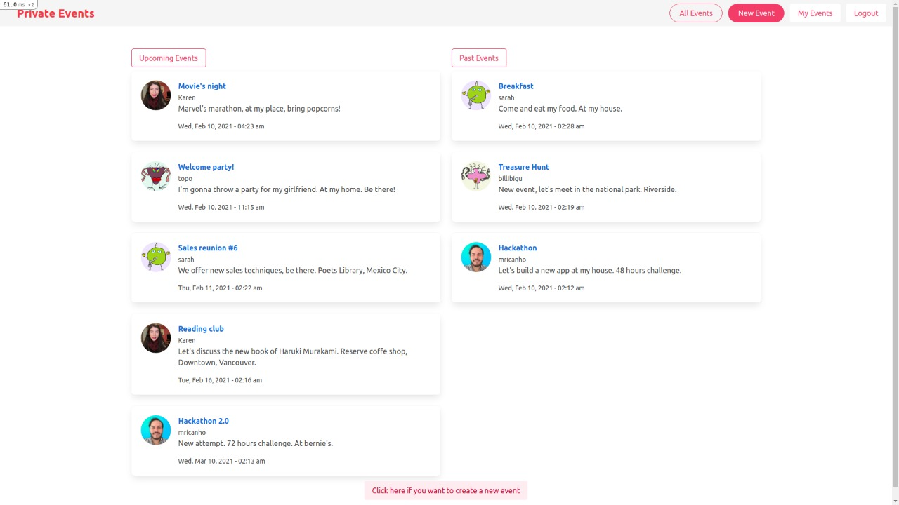

# Private Events

In this project, I built a fully functional event website in which users can attend to other user's events. The scope is to test the knowledge of models, controllers, views, and tests but primarily, the associations between tables in the database.



## Live Demo

<a href="https://murmuring-wildwood-50583.herokuapp.com/">Visit Page</a>

## Built With

- Ruby 2.7.2
- Ruby on Rails 6.1.1
- Rspec gem
- Simple_form gem
- Bulma

### Setup

To run this project locally, please ensure you have Ruby and Ruby on Rails installed on your machine, then clone this repository by running.

```bash
git clone https://github.com/mricanho/members-only
```
Open your terminal and CD to the directory where you create the clone repository.

Now run:

```bash
bundle install
```
Then run:

```bash
rails db:migrate
```
To set up the server put:
```bash
rails s
```
After this you can open your favorite web-browser and copy paste the next:

```bash
http://localhost:3000
```
### Author

👤 *Miguel Ricaño*

- Github: [@mricanho](https://github.com/mricanho)
- Linkedin: [Miguel Ricaño](https://www.linkedin.com/in/mricanho/)

👤 **Harshdeep Kanhai**

- GitHub: [@harshdeepkanhai](https://github.com/harshdeepkanhai)
- Twitter: [@harshdeepkanhai](https://twitter.com/harshdeepkanhai)
- LinkedIn: [harshdeepkanhai](https://linkedin.com/in/harshdeepkanhai)

## Show your support

Give a ⭐️ if you like this project!

## Acknowledgments

- Microverse
- The Odin Project

## 📝 License

This project is [MIT](LICENSE) licensed.
